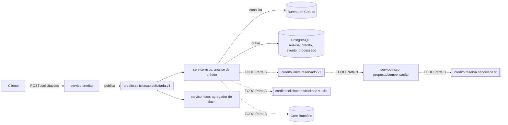

# Arquitetura do projeto — concessão de crédito

Este documento descreve a arquitetura do sistema de concessão de crédito, da solicitação ao desembolso, para quem chega ao repositório sem ter acompanhado a disciplina.

> Algumas seções (marcadas com `TODO`) dependem de código que ainda está em desenvolvimento (Parte A — caminho de falha, Parte B — saga e compensação). Elas serão atualizadas conforme esses PRs forem mergeados.

## 1. Domínio e contexto de negócio

O sistema cobre a concessão de crédito a partir da solicitação do cliente até o desembolso pelo Core Bancário. O processo:

1. O cliente solicita crédito (`CréditoSolicitado`).
2. O `servico-risco` avalia elegibilidade (score, capacidade de pagamento). Se aprovado, segue o fluxo; se recusado, o processo encerra ali.
3. Com a elegibilidade aprovada, o limite disponível do cliente é reservado (`LimiteDeCreditoReservado`) antes de a proposta ser apresentada.
4. O cliente aceita, recusa ou deixa a proposta expirar. Recusa ou expiração cancelam a reserva (`ReservaDeLimiteCancelada`), devolvendo o limite. Aceite segue para assinatura de contrato e desembolso pelo Core Bancário (`CréditoLiberado`).

A justificativa completa do domínio — incluindo por que ele foi escolhido em vez de outras propostas do grupo — está na [ADR-002](adr/ADR-002-dominio-do-projeto.md).

## 2. Contrato do evento

O evento `credito.solicitacao.solicitada.v1` é o único publicado até o momento. Campos, tipos, obrigatoriedade e exemplo de payload estão detalhados em [contrato.md](contrato.md).

Os demais eventos da saga (`LimiteDeCreditoReservado`, `PropostaDeCreditoRecusada`, `PropostaDeCreditoExpirada`, `ReservaDeLimiteCancelada`) estão nomeados e desenhados na ADR-002, mas ainda não têm contrato publicado — `TODO`: mover para `contrato.md` (ou um contrato por evento) assim que o código da Parte B for mergeado.

## 3. Compatibilidade e evolução

A regra de compatibilidade adotada é **FULL**, e o contexto organizacional que a justifica (quantos consumidores hoje, quem controla cada deploy) está em [contrato.md](contrato.md#contexto-organizacional-da-regra-de-compatibilidade).

## 4. Decisões arquiteturais (ADRs)

| ADR                                          | Decisão                                                                                                                                                   | Status                           |
| -------------------------------------------- | --------------------------------------------------------------------------------------------------------------------------------------------------------- | -------------------------------- |
| [ADR-002](adr/ADR-002-dominio-do-projeto.md) | Domínio do projeto: concessão de crédito, pontos de decisão, sistemas externos, caminho de compensação, granularidade dos eventos e chave de deduplicação | Aceita                           |
| ADR-006                                      | Retentativas contra o Core Bancário e tratamento de falha na compensação                                                                                  | `TODO` — em elaboração (Parte C) |

## 5. Visão geral dos componentes e fluxo de eventos

Dois serviços Spring Boot, comunicando-se por Kafka, cada um com seu próprio ciclo de deploy:

Tópico com código hoje: `credito.solicitacao.solicitada.v1`. Os demais nomes de tópico (reserva, cancelamento, DLQ) são provisórios até Vinícius/Hugo confirmarem o nome real publicado no código — `TODO`: atualizar o diagrama com os nomes definitivos.

## 6. Consequências aceitas e riscos assumidos

Herdadas da ADR-002 (seção "Consequências aceitas"): gestão de estado de propostas de longa duração, idempotência complexa para evitar duplo desembolso, dependência de mocks para bureaus/antifraude externos.

`TODO`: quando a Parte A (retentativa/DLQ) e a Parte B (saga/compensação) estiverem implementadas, acrescentar aqui os riscos residuais específicos delas (ex: número de tentativas contra o Core Bancário e o que acontece se a própria compensação falhar — ver ADR-006).

## 7. Observabilidade

Num fluxo em que dinheiro sai do banco, as perguntas relevantes de operação não são as mesmas de um sistema de leitura. Três perguntas que o sistema precisa responder:

- **Quantas solicitações estão paradas?** Hoje, `evento_processado` (servico-risco) registra o `eventoId` de toda solicitação processada; uma solicitação sem análise correspondente em `analise_credito` após um tempo esperado é uma solicitação parada. `TODO`: quando a Parte A existir, cruzar com a DLQ — uma solicitação que caiu na DLQ também está parada, e precisa aparecer nessa mesma pergunta.
- **Há reserva de limite sem desfecho?** `TODO` — depende da tabela consultável de limite reservado (Parte B, item 1 do Vinícius). Uma reserva sem `ReservaDeLimiteCancelada` nem `CréditoLiberado` associado após um tempo é uma reserva presa, e é exatamente o cenário que a ADR-002 já nomeia como risco ("limite preso").
- **Algum desembolso saiu duas vezes?** A defesa é a deduplicação pelo `eventoId` (ver ADR-002, seção "Granularidade dos eventos e chave de deduplicação"). Observabilidade aqui é: contar desembolsos por `solicitacaoId` e alertar se for maior que 1 — hoje não há esse contador porque o desembolso ainda não existe no código.

## 8. O que ficou de fora, e o custo

Fora do escopo deste projeto (ver ADR-002): cobrança de parcelas, emissão de boletos, renegociação, faturamento mensal pós-crédito, e contabilidade interna detalhada (ledger/partidas dobradas) — deixados para o sistema bancário real.

O custo de deixar isso de fora: o sistema garante que o crédito foi liberado uma única vez, mas não acompanha o ciclo de vida do empréstimo depois disso. Qualquer pergunta sobre "o cliente está pagando em dia" ou "quanto falta quitar" exigiria um novo domínio (cobrança), fora deste recorte — e integrá-lo depois significa decidir, de novo, que evento marca a fronteira entre "crédito concedido" e "crédito sendo pago", com o mesmo cuidado de idempotência que este projeto já teve que ter para o desembolso.
