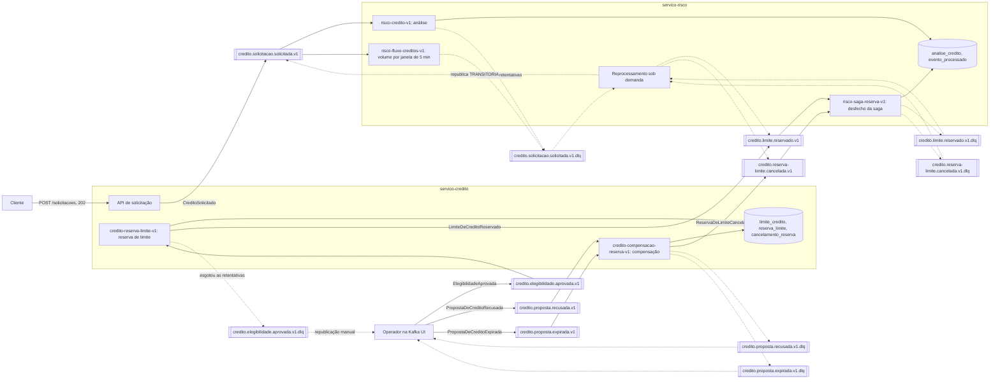

# Arquitetura do sistema de concessão de crédito

Este documento explica o sistema para quem vai mantê-lo sem ter participado das decisões: o que ele faz, como os serviços conversam, o que acontece quando algo falha, onde ele trava quando cresce e o que ficou de fora. Para subir o ambiente e rodar os testes, veja o [README](../README.md).

## 1. O domínio

O sistema cobre a concessão de crédito, da solicitação do cliente até o desembolso pelo Core Bancário. O processo:

1. O cliente solicita crédito (`CreditoSolicitado`).
2. A solicitação é avaliada quanto a elegibilidade (score, capacidade de pagamento). Se aprovada, segue (`ElegibilidadeAprovada`); se recusada, o processo encerra.
3. Com a elegibilidade aprovada, o valor aprovado é reservado do limite disponível do cliente (`LimiteDeCreditoReservado`) antes de a proposta ser apresentada.
4. O cliente aceita, recusa (`PropostaDeCreditoRecusada`) ou deixa a proposta expirar (`PropostaDeCreditoExpirada`). Recusa e expiração cancelam a reserva e devolvem o limite (`ReservaDeLimiteCancelada`). O aceite segue para contrato e desembolso (`CreditoLiberado`).

Dois riscos organizam as decisões: o **duplo desembolso** (o mesmo fato liberando dinheiro duas vezes sob reentrega) e o **limite preso** (reserva sem desfecho, deixando o cliente com menos limite do que tem).

O sistema responde a duas perguntas de negócio:

- **Em que pé está esta solicitação?** Pendente de desfecho, com limite reservado, ou com a reserva cancelada e o limite devolvido. A resposta está em `analise_credito.status` e em `reserva_limite.status`.
- **Qual foi o volume de crédito solicitado a cada janela de 5 minutos?** Quantidade e valor total por janela, pela hora em que a solicitação ocorreu. A resposta sai no log do `servico-risco`.

Neste recorte estão implementados os passos 1, 3 e 4 até a compensação. A avaliação de elegibilidade, a proposta, o contrato e o desembolso estão fora do código; os eventos que eles publicariam são publicados à mão pela Kafka UI para exercitar a saga. A justificativa do domínio está na [ADR-002](adr/ADR-002-dominio.md).

## 2. Os eventos

Cada evento é um fato consumado, com nome no particípio e na linguagem do domínio, e um tópico por tipo de evento (o nome do tópico é o `ce_type`). Não há evento genérico com um campo "tipo" dentro: recusa e expiração são eventos distintos porque, na auditoria, importa saber se o cliente recusou ou se o prazo venceu, mesmo que a reação seja a mesma.

| Evento | Tópico | Publicado por | Consumido por | Contrato |
|---|---|---|---|---|
| CreditoSolicitado | `credito.solicitacao.solicitada.v1` | `servico-credito` | `servico-risco` (dois grupos) | [contrato.md](contrato.md) |
| ElegibilidadeAprovada | `credito.elegibilidade.aprovada.v1` | fora do recorte (Kafka UI) | `servico-credito` | [contratos-da-saga.md](contratos-da-saga.md#elegibilidadeaprovada) |
| LimiteDeCreditoReservado | `credito.limite.reservado.v1` | `servico-credito` | `servico-risco` | [contratos-da-saga.md](contratos-da-saga.md#limitedecreditoreservado) |
| PropostaDeCreditoRecusada | `credito.proposta.recusada.v1` | fora do recorte (Kafka UI) | `servico-credito` | [contratos-da-saga.md](contratos-da-saga.md#propostadecreditorecusada) |
| PropostaDeCreditoExpirada | `credito.proposta.expirada.v1` | fora do recorte (Kafka UI) | `servico-credito` | [contratos-da-saga.md](contratos-da-saga.md#propostadecreditoexpirada) |
| ReservaDeLimiteCancelada | `credito.reserva-limite.cancelada.v1` | `servico-credito` | `servico-risco` | [contrato.md](contrato.md#evento-de-compensação-reservadelimitecancelada) |

Todos usam envelope CloudEvents 1.0 em modo binário: `ce_specversion`, `ce_id`, `ce_source`, `ce_type` e `ce_time` nos cabeçalhos, carga JSON no corpo. O `ce_id` é igual ao `eventoId` da carga e é a chave de deduplicação de todos os consumidores. Datas vão como texto ISO-8601 com offset, nunca como epoch.

`ReservaDeLimiteCancelada` é o evento de compensação: ele não apaga nem reescreve a reserva, registra um fato novo que desfaz o efeito dela.

Cada serviço declara a própria classe de cada evento, só com os campos que usa, e ignora os campos que não conhece; não há biblioteca de contrato compartilhada. O contrato é o JSON no tópico. A regra de compatibilidade é **FULL** para todos os eventos: campo novo entra como opcional, e nada existente é removido, renomeado ou muda de tipo ou de significado dentro da `v1`. Ela permite que produtores e consumidores subam em qualquer ordem, porque os dois serviços têm deploy independente ([contrato.md](contrato.md#contexto-organizacional-da-regra-de-compatibilidade)). Uma mudança de significado exige um tipo `v2` publicado em paralelo.

## 3. O desenho

Dois serviços Spring Boot, cada um com as suas tabelas e o seu ciclo de deploy, que só se conhecem pelos tópicos. Nenhum chama o outro diretamente.

- **`servico-credito`** recebe a solicitação por HTTP (`POST /solicitacoes`, resposta 202), publica `CreditoSolicitado`, reserva o limite quando a elegibilidade é aprovada e compensa a reserva quando a proposta é recusada ou expira. Tabelas: `limite_credito`, `reserva_limite`, `cancelamento_reserva`.
- **`servico-risco`** registra a análise de cada solicitação, acompanha o desfecho da saga e agrega o volume solicitado por janela. Tabelas: `analise_credito`, `evento_processado`.

Todos os tópicos têm três partições e a mesma chave, `solicitacaoId`: os eventos de uma solicitação caem sempre na mesma partição do seu tópico e são lidos na ordem em que foram publicados. Não há ordem entre tópicos diferentes, e o sistema trata os casos em que isso aparece (seção 5).

| Grupo | Serviço | Tópicos | O que faz |
|---|---|---|---|
| `risco-credito-v1` | `servico-risco` | `credito.solicitacao.solicitada.v1` | Grava a análise com status `PENDENTE`, deduplicando por `ce_id` |
| `risco-fluxo-creditos-v1` | `servico-risco` | `credito.solicitacao.solicitada.v1` | Soma quantidade e valor por janela de 5 minutos, em memória |
| `risco-saga-reserva-v1` | `servico-risco` | `credito.limite.reservado.v1`, `credito.reserva-limite.cancelada.v1` | Leva o desfecho da saga para `analise_credito.status` |
| `credito-reserva-limite-v1` | `servico-credito` | `credito.elegibilidade.aprovada.v1` | Reserva o valor aprovado e publica `LimiteDeCreditoReservado` |
| `credito-compensacao-reserva-v1` | `servico-credito` | `credito.proposta.recusada.v1`, `credito.proposta.expirada.v1` | Devolve o limite e publica `ReservaDeLimiteCancelada` |

Os dois grupos do `servico-risco` que leem `credito.solicitacao.solicitada.v1` recebem cada evento de forma independente: um não rouba o evento do outro, e cada um confirma o próprio offset.

O diagrama mostra o caminho feliz e o de exceção juntos. As setas tracejadas são o caminho de falha: o registro que esgota as retentativas vai para a DLQ do tópico, e o reprocessamento o devolve ao tópico de origem.


```mermaid
flowchart LR
    Cliente -->|POST /solicitacoes, 202| SC_API

    subgraph SC[servico-credito]
        SC_API[API de solicitação]
        SC_RES[credito-reserva-limite-v1: reserva de limite]
        SC_COMP[credito-compensacao-reserva-v1: compensação]
        SC_DB[(limite_credito, reserva_limite, cancelamento_reserva)]
    end

    subgraph SR[servico-risco]
        SR_AN[risco-credito-v1: análise]
        SR_FL[risco-fluxo-creditos-v1: volume por janela de 5 min]
        SR_SAGA[risco-saga-reserva-v1: desfecho da saga]
        SR_REP[Reprocessamento sob demanda]
        SR_DB[(analise_credito, evento_processado)]
    end

    OP[Operador na Kafka UI]

    SC_API -->|CreditoSolicitado| T1[[credito.solicitacao.solicitada.v1]]
    T1 --> SR_AN
    T1 --> SR_FL
    SR_AN --> SR_DB

    OP -->|ElegibilidadeAprovada| T2[[credito.elegibilidade.aprovada.v1]]
    T2 --> SC_RES
    SC_RES --> SC_DB
    SC_RES -->|LimiteDeCreditoReservado| T3[[credito.limite.reservado.v1]]

    OP -->|PropostaDeCreditoRecusada| T4[[credito.proposta.recusada.v1]]
    OP -->|PropostaDeCreditoExpirada| T5[[credito.proposta.expirada.v1]]
    T4 --> SC_COMP
    T5 --> SC_COMP
    SC_COMP --> SC_DB
    SC_COMP -->|ReservaDeLimiteCancelada| T6[[credito.reserva-limite.cancelada.v1]]

    T3 --> SR_SAGA
    T6 --> SR_SAGA
    SR_SAGA --> SR_DB

    SR_AN -.->|esgotou as retentativas| D1[[credito.solicitacao.solicitada.v1.dlq]]
    SR_FL -.-> D1
    SR_SAGA -.-> D3[[credito.limite.reservado.v1.dlq]]
    SR_SAGA -.-> D6[[credito.reserva-limite.cancelada.v1.dlq]]
    SC_RES -.->|esgotou as retentativas| D2[[credito.elegibilidade.aprovada.v1.dlq]]
    SC_COMP -.-> D4[[credito.proposta.recusada.v1.dlq]]
    SC_COMP -.-> D5[[credito.proposta.expirada.v1.dlq]]

    D1 -.-> SR_REP
    D3 -.-> SR_REP
    D6 -.-> SR_REP
    SR_REP -.->|republica TRANSITORIA| T1
    SR_REP -.-> T3
    SR_REP -.-> T6
    D2 -.->|republicação manual| OP
    D4 -.-> OP
    D5 -.-> OP
```

O caminho de uma solicitação, com os números do teste de compensação:

1. `POST /solicitacoes` responde 202 e publica `CreditoSolicitado`. O `servico-risco` grava a análise com status `PENDENTE`.
2. `ElegibilidadeAprovada` de 3.000 chega ao `servico-credito`: o limite do cliente cai de 10.000 para 7.000, a reserva é gravada como `RESERVADA` e `LimiteDeCreditoReservado` é publicado. O `servico-risco` muda a análise para `RESERVADA`.
3. `PropostaDeCreditoRecusada` chega: a reserva passa a `CANCELADA`, o limite volta a 10.000 e `ReservaDeLimiteCancelada` é publicado. O `servico-risco` muda a análise para `CANCELADA`.
4. A mesma recusa entregue de novo não devolve o limite outra vez: continua 10.000.

## 4. As decisões

| ADR | Decisão | Consequência aceita |
|---|---|---|
| [ADR-002](adr/ADR-002-dominio.md) | Concessão de crédito como domínio, com a reserva de limite e sua compensação como caminho de exceção, e deduplicação por `ce_id` | O estado de propostas de longa duração e a idempotência do desembolso passam a ser responsabilidade do sistema, e os sistemas externos (bureau, antifraude, Core Bancário) ficam simulados |
| [ADR-006](adr/ADR-006-resiliencia.md) | Retentativa limitada e bloqueante, DLQ por tópico com motivo e classificação, reprocessamento manual, compensação idempotente e saga coreografada | Uma partição fica parada enquanto um registro retenta, e uma compensação que cai na DLQ deixa o limite preso até alguém reprocessá-la |

## 5. Quando falha

**Retentativa limitada.** Os consumidores dos dois serviços seguem a mesma política ([ADR-006](adr/ADR-006-resiliencia.md)). Uma falha **transitória** (banco indisponível, ou um evento que chegou antes daquele de que depende) é retentada quatro vezes, com espera de 0,5 s, 1 s, 2 s e 4 s. Uma falha **permanente** (payload que não desserializa, `ce_id` ausente, violação de integridade, cliente sem limite cadastrado ou com limite insuficiente) não é retentada, porque repetir produz o mesmo erro. A retentativa é bloqueante: enquanto um registro retenta, os seguintes da mesma partição esperam, e é isso que preserva a ordem por `solicitacaoId`.

**DLQ por tópico.** Esgotadas as tentativas, ou na primeira falha permanente, o registro vai para `<tópico>.dlq` com a mesma chave, os cabeçalhos `ce_*` originais, o motivo e a origem (`kafka_dlt-exception-*`, `kafka_dlt-original-*`) e a classificação (`classificacao`: `PERMANENTE` ou `TRANSITORIA`). O offset do registro original é confirmado e a partição segue.

**Reprocessamento.** É manual, depois de corrigida a causa:

- o `servico-risco` sobe com `app.kafka.reprocessamento-dlq.habilitado=true`, lê cada DLQ até o fim que ela tinha no início da execução e republica no tópico de origem os registros `TRANSITORIA`, uma vez por registro de origem. Os `PERMANENTE` ficam na DLQ;
- no `servico-credito`, o registro é republicado à mão pela Kafka UI, com a mesma chave e os mesmos `ce_*`. O passo a passo está no README.

Reprocessar é seguro porque todo consumidor é idempotente: a análise e o desfecho da saga deduplicam por `ce_id` na mesma transação do efeito, a reserva é única por `solicitacaoId` e a compensação é única por evento de origem.

**Compensação.** Quando a proposta é recusada ou expira, o `servico-credito` devolve o valor ao limite do cliente, grava uma linha nova em `cancelamento_reserva` e publica `ReservaDeLimiteCancelada`. A reserva não é apagada: `reserva_limite.status` passa a `CANCELADA`, como estado derivado, e o fato que registra o desfazer é o evento publicado. Não há transação atravessando os serviços; o `servico-risco` reage ao evento e marca a análise como `CANCELADA`.

**Quando a própria compensação falha.**

- A recusa que chega antes da reserva é falha transitória: retenta e, se a reserva não aparecer a tempo, vai para a DLQ, de onde é republicada quando a reserva existir. Enquanto isso, o limite fica preso.
- Uma segunda compensação da mesma solicitação (recusa e expiração) encontra a reserva já cancelada e é ignorada, sem devolver o limite de novo e sem ir para a DLQ.
- A mesma recusa entregue de novo reusa o cancelamento gravado e publica o mesmo evento outra vez.

**Ordem entre tópicos.** Não é garantida, e os consumidores tratam os casos conhecidos: o desfecho da saga que chega antes da análise é falha transitória, e as transições de status só avançam, então uma reserva atrasada não desfaz um cancelamento já registrado.

**Riscos que ficam.**

- **Sem outbox.** Se a publicação de `LimiteDeCreditoReservado` falhar depois do commit, a reentrega não republica. Na compensação esse caso está coberto, porque a reentrega reusa o cancelamento gravado.
- **Retenção da DLQ.** A DLQ usa a retenção padrão do broker, 7 dias. O que não for reprocessado nesse prazo se perde.
- **Saga coreografada.** Nenhum componente conhece a sequência inteira; o desfecho se reconstrói pelos status (seção 7).

## 6. Quando cresce

**O teto de paralelismo é o número de partições.** Cada tópico tem três partições, então cada grupo processa no máximo três registros em paralelo, com até três instâncias do serviço. Uma quarta instância no mesmo grupo fica parada, sem partição atribuída. Subir mais instâncias é o primeiro passo quando o atraso cresce, e só vale até esse teto.

**O sinal para escalar é o consumer lag, não a CPU.** O gargalo esperado é espera de I/O (banco e broker), não processamento. O que mostra que o serviço não acompanha é a diferença entre o fim do tópico e o offset confirmado de cada grupo, medida por grupo, porque cada grupo atrasa por motivos próprios:

```bash
docker exec aed-equipe-05-kafka /opt/kafka/bin/kafka-consumer-groups.sh --bootstrap-server kafka:9094 --describe --group risco-credito-v1
```

**Onde trava primeiro.**

- **A retentativa bloqueante.** Com o banco fora do ar, cada registro segura a sua partição por vários segundos antes de ir para a DLQ, e o lag daquela partição cresce para todas as solicitações que caem nela. Mais instâncias não ajudam, porque a partição continua com um único consumidor.
- **O banco compartilhado.** No ambiente padrão, os dois serviços apontam para o mesmo banco PostgreSQL (`BANCO_URL`), com tabelas separadas. O pool de conexões e o disco são os mesmos, e um pico de solicitações pesa nos dois serviços ao mesmo tempo. Separar os bancos é mudar a variável, sem mudar código.
- **O agregador em memória.** O estado das janelas fica em cada instância. Com mais de uma instância no grupo `risco-fluxo-creditos-v1`, cada uma soma só as partições que recebeu, e o total da janela passa a estar espalhado em logs diferentes. Escalar o agregador exige antes levar o estado para uma tabela.

**O que a chave de partição limita.** `solicitacaoId` é um UUID, então as solicitações se distribuem por igual e não há chave quente. O preço é que a ordem só vale dentro de uma solicitação: duas solicitações do mesmo cliente podem ser processadas ao mesmo tempo em partições diferentes. A reserva protege o limite com um `update` condicional (`limite_disponivel >= valor`), então duas reservas simultâneas não deixam o limite negativo, mas não existe ordem entre elas.

**Aumentar partições tem custo.** Mudar de três para mais partições muda a partição de cada chave, e eventos novos de uma solicitação em andamento podem cair numa partição diferente dos antigos, quebrando a ordem justamente para as solicitações em curso. O caminho seguro é criar o tópico novo com mais partições e migrar os produtores quando os consumidores tiverem esvaziado o antigo.

**Broker único.** O ambiente tem um broker e fator de replicação 1. Serve para desenvolvimento; em produção, a perda do broker para tudo e pode perder eventos já confirmados.

## 7. O que se enxerga

Num fluxo em que dinheiro sai do banco, as perguntas de operação são estas três, e todas têm resposta no estado persistido.

**Quantas solicitações estão paradas?** Uma solicitação parada tem análise sem desfecho da saga depois do tempo esperado, ou está na DLQ.

```sql
-- servico-risco: análises sem reserva nem cancelamento há mais de 1 hora
select solicitacao_id, status, solicitada_em
  from analise_credito
 where status = 'PENDENTE'
   and solicitada_em < now() - interval '1 hour';
```

As que caíram na DLQ aparecem nos tópicos `*.dlq`, com o motivo em `kafka_dlt-exception-message` e a classificação em `classificacao`. Registros `TRANSITORIA` são candidatos a reprocessamento; `PERMANENTE` exigem correção do dado. Um lag que cresce num grupo, sem exceção no log, é o sinal de partição presa em retentativa (seção 6).

**Há reserva de limite sem desfecho?** É o cenário de limite preso.

```sql
-- servico-credito: reservas ainda abertas há mais de 1 dia
select solicitacao_id, cliente_id, valor_reservado, reservada_em
  from reserva_limite
 where status = 'RESERVADA'
   and reservada_em < now() - interval '1 day';
```

Uma reserva cancelada continua na tabela com `status = CANCELADA` e `cancelada_em` preenchido; o detalhe da compensação (motivo, valor devolvido, evento de origem) está em `cancelamento_reserva`.

**Algum desembolso saiu duas vezes?** O desembolso não existe neste recorte. O equivalente implementado é a devolução de limite:

```sql
-- servico-credito: mais de um cancelamento para a mesma solicitação (esperado: nenhuma linha)
select solicitacao_id, count(*) from cancelamento_reserva group by solicitacao_id having count(*) > 1;
```

A consulta é uma conferência: a tabela já tem `solicitacao_id` único, e o banco recusa limite disponível acima do total (`check (limite_disponivel <= limite_total)`). Quando o desembolso existir, a mesma consulta vale para os desembolsos por `solicitacaoId`.

Os logs completam o quadro: toda publicação registra partição e offset, todo envio para a DLQ é registrado, e o reprocessamento do `servico-risco` registra cada registro republicado ou ignorado.

## 8. O que ficou de fora

**Fora do código deste recorte, e o custo de trazer:**

- **Serviços de elegibilidade e de proposta.** Hoje `ElegibilidadeAprovada`, `PropostaDeCreditoRecusada` e `PropostaDeCreditoExpirada` são publicados à mão. Trazê-los exige um serviço novo com seu próprio contrato de publicação e, para a expiração, um agendador que publique o evento por decurso de prazo; sem isso, uma proposta que o cliente nunca responde deixa o limite preso para sempre.
- **Contrato, desembolso e Core Bancário.** A regra de retentativa já está decidida na ADR-006 (no máximo três tentativas, chave de idempotência obrigatória, timeout tratado como resultado desconhecido), mas não está testada. Implementar exige um consumidor de `PropostaAceita` e um ledger mínimo para responder "este desembolso já saiu?".
- **Reprocessador no `servico-credito`.** Hoje a DLQ da compensação é republicada à mão. Um reprocessador como o do `servico-risco` custa uma classe e um teste, e tiraria da mão do operador a republicação que destrava o limite preso.
- **Outbox.** Eliminaria a janela entre o commit e a publicação da reserva. Custa uma tabela de saída e um processo que a publica.
- **Projeção persistida do volume por janela.** O agregador guarda o estado em memória. Reiniciar o serviço zera os totais, e como o grupo já confirmou os offsets, os eventos anteriores só voltam a ser somados relendo o tópico com um grupo novo. Custa uma tabela por janela e a mesma deduplicação que o agregador já faz em memória, e é o que permite escalar o agregador (seção 6).
- **Alerta de lag.** O lag é consultado à mão. Um alarme por grupo, combinado com a consulta dos offsets finais do tópico para não depender de um consumidor que pode estar fora do ar, custa um coletor de métricas e um limiar por grupo.

**Fora do domínio (ADR-002):** cobrança de parcelas, boletos, renegociação, faturamento e contabilidade interna. O sistema garante que o crédito é concedido uma única vez, mas não acompanha o empréstimo depois disso. Integrar a cobrança depois significa decidir qual evento marca a fronteira entre "crédito concedido" e "crédito sendo pago", com o mesmo cuidado de idempotência que o desembolso exige.
