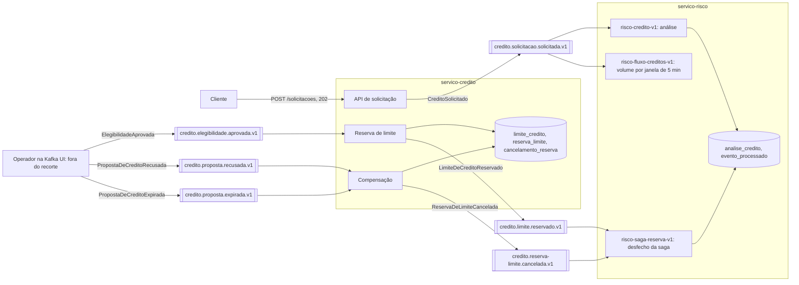

# Arquitetura do projeto - concessão de crédito

Este documento descreve a arquitetura do sistema de concessão de crédito para quem chega ao repositório sem ter acompanhado a disciplina. Para rodar o projeto, veja o [README](../README.md).

## 1. Domínio e contexto de negócio

O sistema cobre a concessão de crédito da solicitação do cliente até o desembolso pelo Core Bancário. O processo:

1. O cliente solicita crédito (`CreditoSolicitado`).
2. A solicitação é avaliada quanto a elegibilidade (score, capacidade de pagamento). Se aprovada, segue (`ElegibilidadeAprovada`); se recusada, o processo encerra.
3. Com a elegibilidade aprovada, o valor aprovado é reservado do limite disponível do cliente (`LimiteDeCreditoReservado`) antes de a proposta ser apresentada.
4. O cliente aceita, recusa (`PropostaDeCreditoRecusada`) ou deixa a proposta expirar (`PropostaDeCreditoExpirada`). Recusa e expiração cancelam a reserva e devolvem o limite (`ReservaDeLimiteCancelada`). O aceite segue para contrato e desembolso (`CreditoLiberado`).

Dois riscos organizam as decisões: o **duplo desembolso** (o mesmo fato liberando dinheiro duas vezes sob reentrega) e o **limite preso** (reserva sem desfecho, deixando o cliente com menos limite do que tem).

Neste recorte estão implementados os passos 1, 3 e 4 até a compensação. A avaliação de elegibilidade, a proposta, o contrato e o desembolso estão fora do código; os eventos que eles publicariam são publicados à mão pela Kafka UI para exercitar a saga. A justificativa do domínio está na [ADR-002](adr/ADR-002-dominio-do-projeto.md).

## 2. Contrato do evento

Todos os eventos usam envelope CloudEvents 1.0 em modo binário (atributos `ce_*` nos cabeçalhos, carga JSON no corpo), chave de partição `solicitacaoId` e datas ISO-8601 com offset.

| Evento                    | Tópico                                | Publicado por              | Consumido por                 | Contrato                                                               |
| ------------------------- | ------------------------------------- | -------------------------- | ----------------------------- | ---------------------------------------------------------------------- |
| CreditoSolicitado         | `credito.solicitacao.solicitada.v1`   | `servico-credito`          | `servico-risco` (dois grupos) | [contrato.md](contrato.md)                                             |
| ElegibilidadeAprovada     | `credito.elegibilidade.aprovada.v1`   | fora do recorte (Kafka UI) | `servico-credito`             | [contratos-da-saga.md](contratos-da-saga.md#elegibilidadeaprovada)     |
| LimiteDeCreditoReservado  | `credito.limite.reservado.v1`         | `servico-credito`          | `servico-risco`               | [contratos-da-saga.md](contratos-da-saga.md#limitedecreditoreservado)  |
| PropostaDeCreditoRecusada | `credito.proposta.recusada.v1`        | fora do recorte (Kafka UI) | `servico-credito`             | [contratos-da-saga.md](contratos-da-saga.md#propostadecreditorecusada) |
| PropostaDeCreditoExpirada | `credito.proposta.expirada.v1`        | fora do recorte (Kafka UI) | `servico-credito`             | [contratos-da-saga.md](contratos-da-saga.md#propostadecreditoexpirada) |
| ReservaDeLimiteCancelada  | `credito.reserva-limite.cancelada.v1` | `servico-credito`          | `servico-risco`               | [contratos-da-saga.md](contratos-da-saga.md#reservadelimitecancelada)  |

Cada serviço declara a própria classe de cada evento, com só os campos que usa; não há JAR de contrato compartilhado. O contrato é o JSON no tópico.

## 3. Compatibilidade e evolução

A regra de compatibilidade é **FULL** para todos os eventos: campo novo entra como opcional, e nada existente é removido, renomeado ou muda de tipo ou de significado dentro da `v1`. Ela permite que produtores e consumidores subam em qualquer ordem. O contexto organizacional que justifica a regra (quantos consumidores, quem controla cada deploy) está em [contrato.md](contrato.md#contexto-organizacional-da-regra-de-compatibilidade).

## 4. Decisões arquiteturais (ADRs)

| ADR                                                              | Decisão                                                                                                                                              | Status |
| ---------------------------------------------------------------- | ---------------------------------------------------------------------------------------------------------------------------------------------------- | ------ |
| [ADR-002](adr/ADR-002-dominio-do-projeto.md)                     | Domínio: concessão de crédito, pontos de decisão, sistemas externos, caminho de compensação, granularidade dos eventos e chave de deduplicação       | Aceita |
| [ADR-006](adr/ADR-006-retentativa-dlq-e-falha-da-compensacao.md) | Retentativa limitada, DLQ com motivo, reprocessamento manual, falha da compensação, regra de retentativa contra o Core Bancário, coreografia da saga | Aceita |

## 5. Visão geral dos componentes e fluxo de eventos

Dois serviços Spring Boot, cada um com seu banco e seu ciclo de deploy, que só se conhecem pelos tópicos. Todos os tópicos têm três partições e chave `solicitacaoId`.


```mermaid
flowchart LR
    Cliente -->|POST /solicitacoes, 202| SC_API

    subgraph SC[servico-credito]
        SC_API[API de solicitação]
        SC_RES[Reserva de limite]
        SC_COMP[Compensação]
        SC_DB[(limite_credito, reserva_limite, cancelamento_reserva)]
    end

    subgraph SR[servico-risco]
        SR_AN[risco-credito-v1: análise]
        SR_FL[risco-fluxo-creditos-v1: volume por janela de 5 min]
        SR_SAGA[risco-saga-reserva-v1: desfecho da saga]
        SR_DB[(analise_credito, evento_processado)]
    end

    OP[Operador na Kafka UI: fora do recorte]

    SC_API -->|CreditoSolicitado| T1[[credito.solicitacao.solicitada.v1]]
    T1 --> SR_AN
    T1 --> SR_FL
    SR_AN --> SR_DB

    OP -->|ElegibilidadeAprovada| T2[[credito.elegibilidade.aprovada.v1]]
    T2 --> SC_RES
    SC_RES --> SC_DB
    SC_RES -->|LimiteDeCreditoReservado| T3[[credito.limite.reservado.v1]]

    OP -->|PropostaDeCreditoRecusada| T4[[credito.proposta.recusada.v1]]
    OP -->|PropostaDeCreditoExpirada| T5[[credito.proposta.expirada.v1]]
    T4 --> SC_COMP
    T5 --> SC_COMP
    SC_COMP --> SC_DB
    SC_COMP -->|ReservaDeLimiteCancelada| T6[[credito.reserva-limite.cancelada.v1]]

    T3 --> SR_SAGA
    T6 --> SR_SAGA
    SR_SAGA --> SR_DB
```

Cada tópico consumido tem uma DLQ `<tópico>.dlq`: `credito.solicitacao.solicitada.v1.dlq`, `credito.limite.reservado.v1.dlq` e `credito.reserva-limite.cancelada.v1.dlq` no `servico-risco`; `credito.elegibilidade.aprovada.v1.dlq`, `credito.proposta.recusada.v1.dlq` e `credito.proposta.expirada.v1.dlq` no `servico-credito`. Cada serviço tem ainda um consumidor de reprocessamento das próprias DLQs, desligado por padrão.

O caminho de uma solicitação, com os números do teste de compensação:

1. `POST /solicitacoes` responde 202 e publica `CreditoSolicitado`. O `servico-risco` grava a análise com status `PENDENTE`.
2. `ElegibilidadeAprovada` de 3.000 chega ao `servico-credito`: o limite do cliente cai de 10.000 para 7.000, a reserva é gravada como `RESERVADA` e `LimiteDeCreditoReservado` é publicado. O `servico-risco` muda a análise para `RESERVADA`.
3. `PropostaDeCreditoRecusada` chega: a reserva passa a `CANCELADA`, o limite volta a 10.000 e `ReservaDeLimiteCancelada` é publicado. O `servico-risco` muda a análise para `CANCELADA`.
4. A mesma recusa entregue de novo não devolve o limite outra vez: continua 10.000.

## 6. Consequências aceitas e riscos assumidos

Da [ADR-002](adr/ADR-002-dominio-do-projeto.md): estado de propostas de longa duração, idempotência crítica para evitar duplo desembolso, e sistemas externos simulados.

Da [ADR-006](adr/ADR-006-retentativa-dlq-e-falha-da-compensacao.md), os riscos residuais do caminho de falha e da saga:

- **Partição parada por até 7,5 s** enquanto um registro retenta (quatro retentativas, 0,5 s a 4 s). Falha transitória mais longa vai para a DLQ.
- **Limite preso enquanto a compensação estiver na DLQ.** Uma recusa que chega antes da reserva e esgota as tentativas só compensa quando alguém reprocessar a DLQ.
- **Reprocessamento depende de uma pessoa**, e a DLQ tem a retenção padrão do broker (7 dias). O que não for reprocessado nesse prazo se perde.
- **Ordem entre tópicos não é garantida.** Os consumidores tratam os casos conhecidos: a recusa antes da reserva e o desfecho antes da análise são falhas transitórias; uma reserva atrasada não desfaz um cancelamento já registrado.
- **Sem outbox.** Se a publicação de `LimiteDeCreditoReservado` falhar depois do commit, a reentrega não republica. Na compensação esse caso já está coberto: a reentrega reusa o cancelamento gravado e publica de novo.
- **Saga coreografada.** Não há um componente que conheça a sequência inteira; o desfecho é consultável pelos status (seção 7). A orquestração passa a valer quando contrato e desembolso entrarem no fluxo.

## 7. Observabilidade

Num fluxo em que dinheiro sai do banco, as perguntas de operação são estas três, e todas têm resposta no estado persistido.

**Quantas solicitações estão paradas?** Uma solicitação parada tem análise sem desfecho da saga depois do tempo esperado, ou está na DLQ.

```sql
-- servico-risco: análises sem reserva nem cancelamento há mais de 1 hora
select solicitacao_id, status, solicitada_em
  from analise_credito
 where status = 'PENDENTE'
   and solicitada_em < now() - interval '1 hour';
```

As que caíram na DLQ aparecem nos tópicos `*.dlq`, com o motivo em `kafka_dlt-exception-message` e a classificação em `classificacao`. Registros `TRANSITORIA` são candidatos a reprocessamento; `PERMANENTE` exigem correção do dado.

**Há reserva de limite sem desfecho?** É o cenário de limite preso.

```sql
-- servico-credito: reservas ainda abertas há mais de 1 dia
select solicitacao_id, cliente_id, valor_reservado, reservada_em
  from reserva_limite
 where status = 'RESERVADA'
   and reservada_em < now() - interval '1 day';
```

Uma reserva cancelada continua na tabela com `status = CANCELADA` e `cancelada_em` preenchido; o detalhe da compensação (motivo, valor devolvido, evento de origem) está em `cancelamento_reserva`.

**Algum desembolso saiu duas vezes?** O desembolso não existe neste recorte. O equivalente implementado é a devolução de limite, e a pergunta tem duas respostas:

```sql
-- servico-credito: mais de um cancelamento para a mesma solicitação (esperado: nenhuma linha)
select solicitacao_id, count(*) from cancelamento_reserva group by solicitacao_id having count(*) > 1;
```

A consulta é uma conferência: a tabela já tem `solicitacao_id` único, e o banco recusa limite disponível acima do total (`check (limite_disponivel <= limite_total)`). Quando o desembolso existir, a mesma consulta vale para os desembolsos por `solicitacaoId`.

Os logs completam o quadro: toda publicação registra partição e offset, todo envio para a DLQ é registrado, e o reprocessamento registra cada registro reexecutado ou ignorado.

## 8. O que ficou de fora, e o custo

**Fora do código deste recorte, e o custo de trazer:**

- **Serviços de elegibilidade e de proposta.** Hoje `ElegibilidadeAprovada`, `PropostaDeCreditoRecusada` e `PropostaDeCreditoExpirada` são publicados à mão. Trazê-los exige um serviço novo com seu próprio contrato de publicação e, para a expiração, um agendador que publique o evento por decurso de prazo; sem isso, uma proposta que o cliente nunca responde deixa o limite preso para sempre.
- **Contrato, desembolso e Core Bancário.** A regra de retentativa já está decidida na ADR-006 (no máximo três tentativas, chave de idempotência obrigatória, timeout tratado como resultado desconhecido), mas não está testada. Implementar exige um consumidor de `PropostaAceita` e um ledger mínimo para responder "este desembolso já saiu?".
- **Outbox.** Eliminaria a janela entre o commit e a publicação da reserva. Custa uma tabela de saída e um processo que a publica.
- **Projeção persistida do volume por janela.** O agregador guarda o estado em memória. Reiniciar o serviço zera os totais, e como o grupo já confirmou os offsets, os eventos anteriores só voltam a ser somados relendo o tópico com um grupo novo. Custa uma tabela por janela e a mesma deduplicação que o agregador já faz em memória.

**Fora do domínio (ADR-002):** cobrança de parcelas, boletos, renegociação, faturamento e contabilidade interna. O sistema garante que o crédito é concedido uma única vez, mas não acompanha o empréstimo depois disso. Integrar a cobrança depois significa decidir qual evento marca a fronteira entre "crédito concedido" e "crédito sendo pago", com o mesmo cuidado de idempotência que o desembolso exige.
